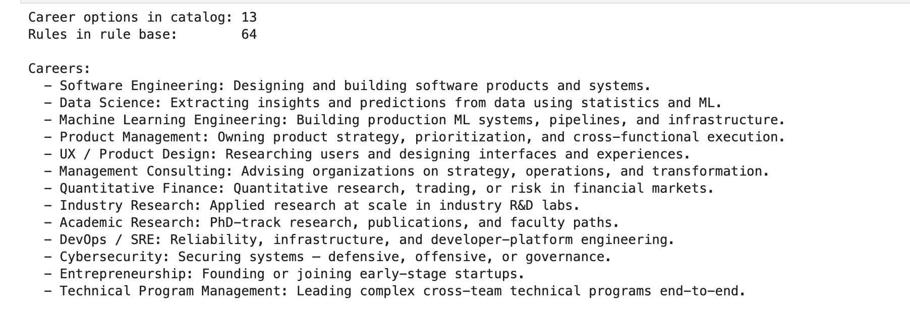
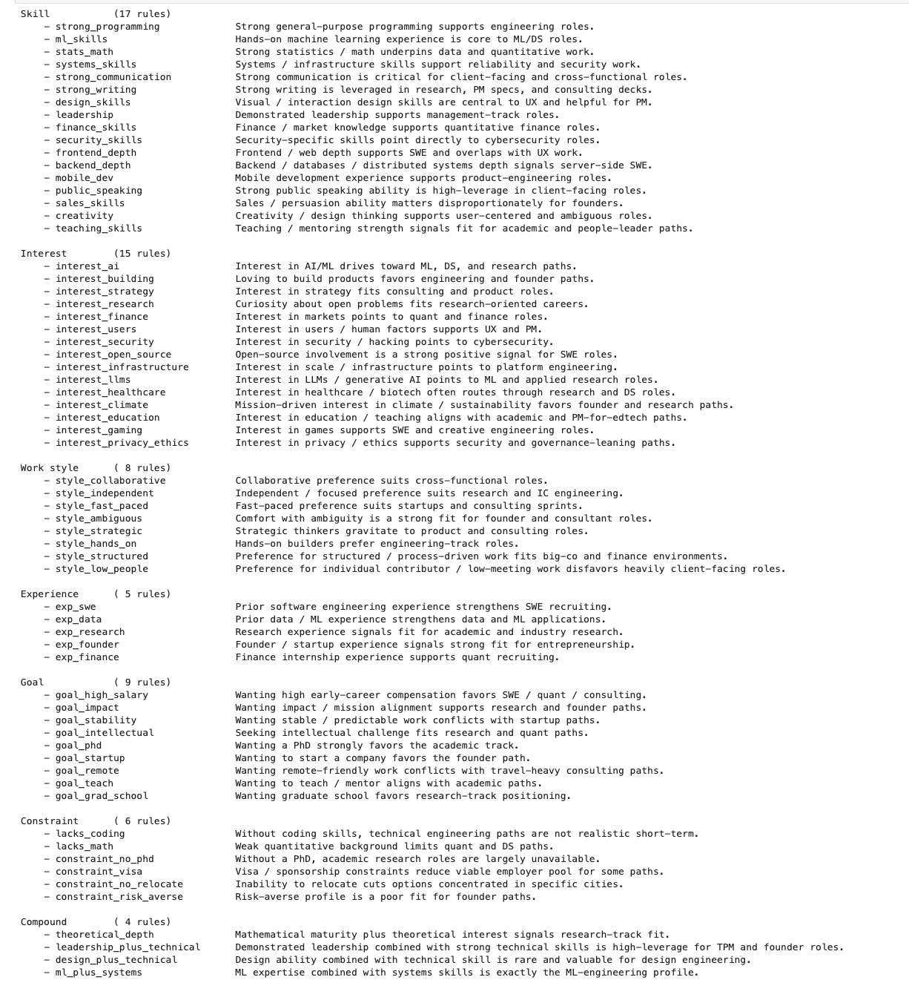
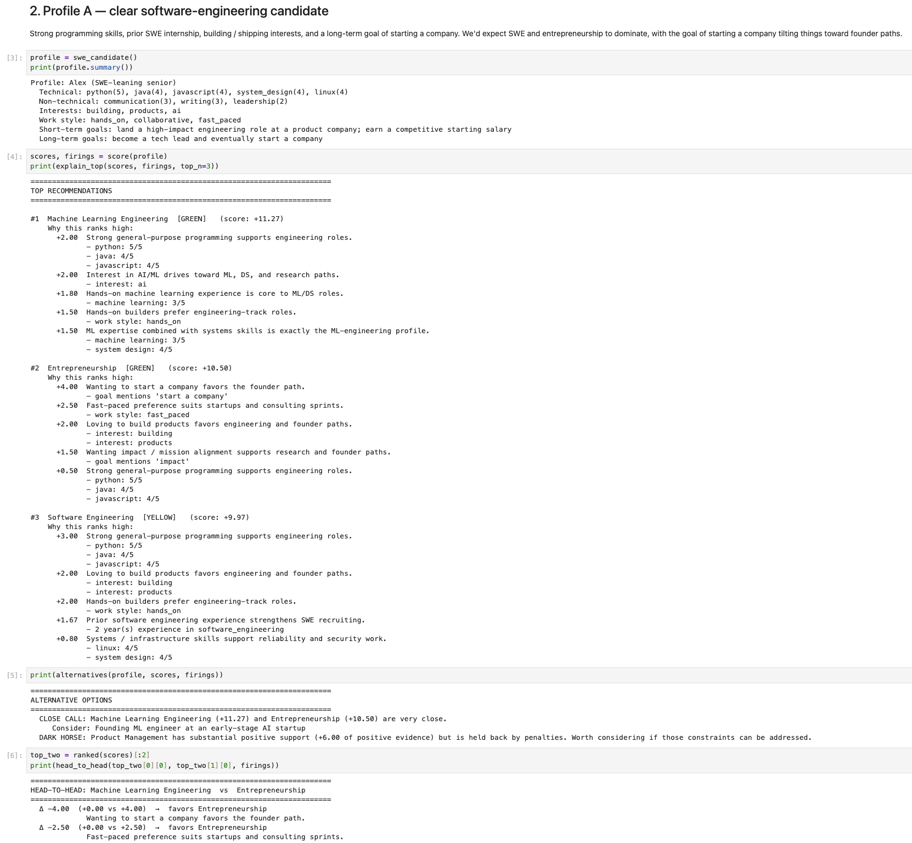
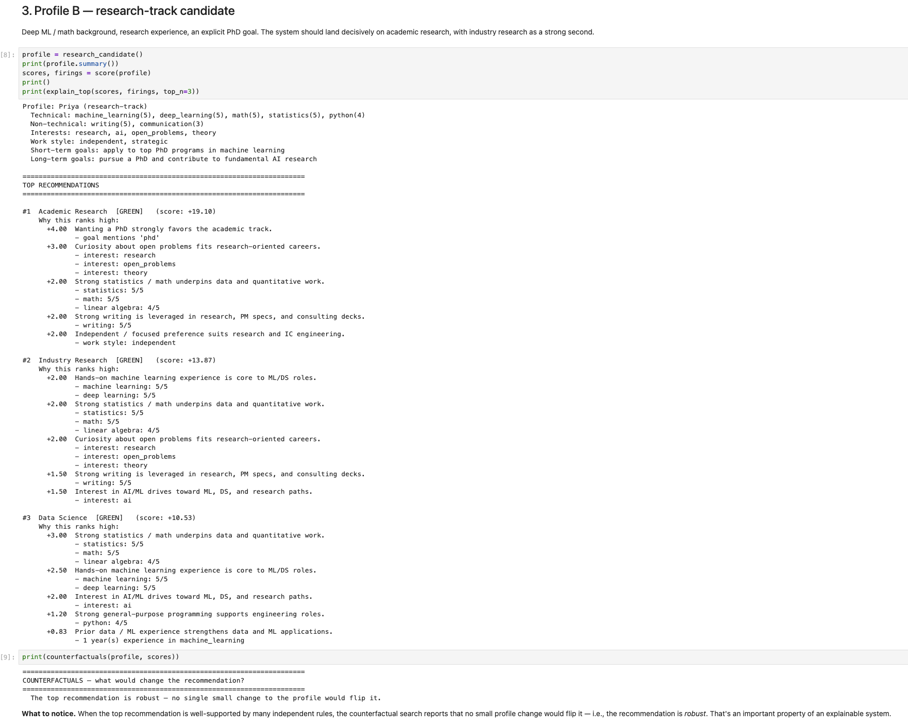
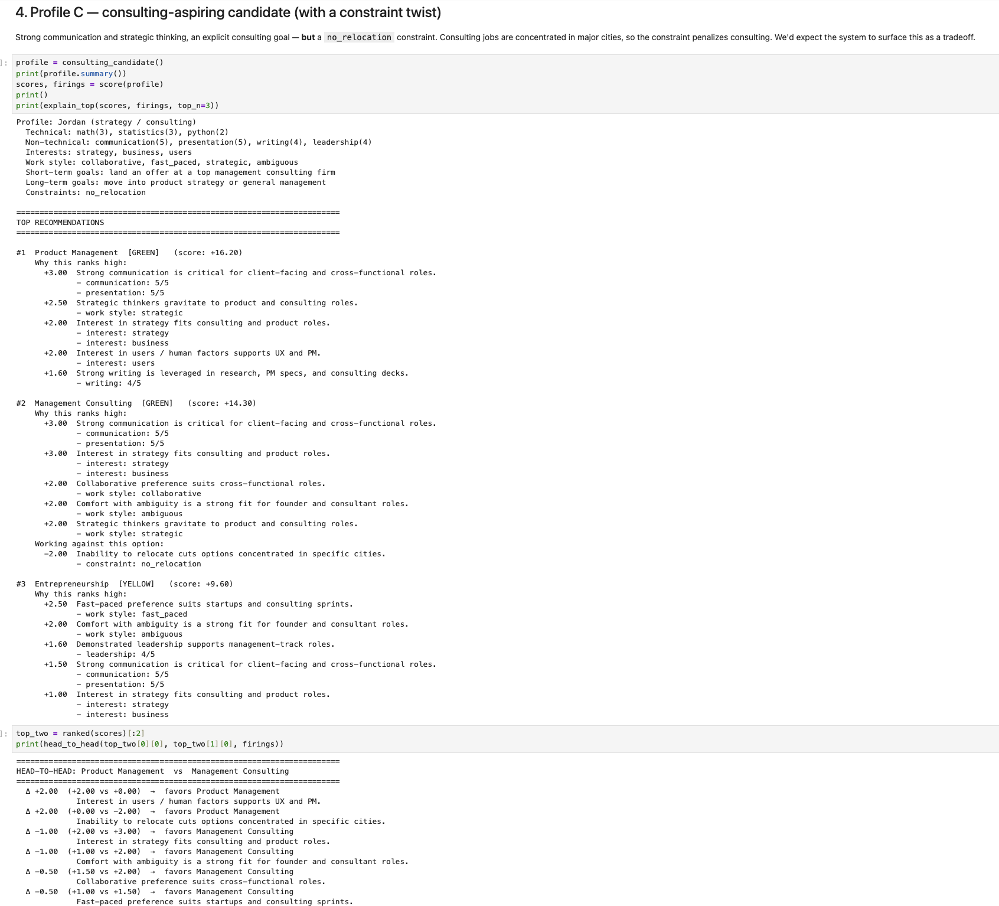
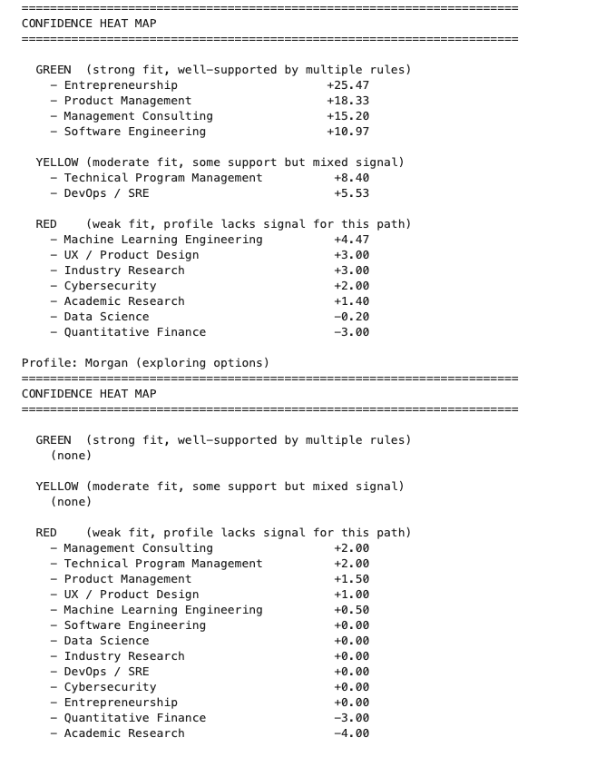

# Explainable Career Decision Support System

Final project for **CS 4580/5580 — Automated Decision Systems**.
An automated decision system that recommends career paths from a structured
user profile, written in pure Python (stdlib only — Jupyter is the only
non-stdlib dependency, for the notebook walkthrough).

The system's defining property is that **every recommendation is fully
explainable**: scores trace back to specific rules, and rules trace back to
specific profile attributes. There is no black box.

## What the system does

1. Takes a `UserProfile` containing technical skills, non-technical skills,
   interests, work experience, work-style preferences, short-term and long-term
   goals, and practical constraints.
2. Runs a rule base (~40 rules across skills, interests, work styles, goals,
   experience, and constraints) and produces a per-career score.
3. Outputs a **ranked recommendation** with:
   - the top positive factors (with the evidence that triggered them)
   - the top negative factors
   - **head-to-head** comparison: which factors push #1 above #2
   - **counterfactuals**: minimal profile changes that would flip the ranking
   - **tradeoffs**: rules that simultaneously favor one career and penalize another
   - **heat map**: qualitative GREEN / YELLOW / RED confidence band per career
   - **alternatives**: hybrid roles, dark-horse options, weak-match warnings

## Why this counts as automated decision-making

The project implements two of the techniques discussed in the course:

- **Rule-based reasoning** — a hand-authored rule base with conditions and
  weighted effects. Every rule firing is structured (`Match` + `RuleFiring`
  records) so the decision trace can be reconstructed after the fact.
- **Option generation** — when the top recommendation is weak, conflicted,
  or nearly tied with the runner-up, the system actively proposes hybrid
  paths, dark-horse careers, or guidance on what to develop.

The explanation engine adds counterfactual generation, head-to-head
comparison, and tradeoff detection on top of that.

## How to run

### In Jupyter (preferred — matches professor's preference)

```bash
pip install jupyter
jupyter notebook career_advisor.ipynb
```

The notebook walks through five sample profiles and a custom-input cell.
Outputs are pre-rendered so it can also be read top-to-bottom without
running.

### From a Python REPL or script

```python
from advisor import score, explain_top, alternatives, counterfactuals
from sample_profiles import swe_candidate

profile = swe_candidate()
scores, firings = score(profile)
print(explain_top(scores, firings, top_n=3))
print(alternatives(profile, scores, firings))
print(counterfactuals(profile, scores))
```

### Zoo compatibility

The core engine uses only the Python standard library, so `import advisor`
works on the zoo with no setup. The notebook walkthrough requires `jupyter`,
which is already available in the zoo's standard environment.

## Project layout

```
automated-decisions-final-project/
├── career_advisor.ipynb        # Main walkthrough notebook
├── advisor/
│   ├── profile.py              # UserProfile dataclass
│   ├── careers.py              # Career catalog (13 paths)
│   ├── rules.py                # Rule base (~40 rules) + DSL helpers
│   ├── scoring.py              # Rule-firing + score aggregation
│   ├── explanation.py          # Top-reasons / head-to-head / counterfactuals / tradeoffs
│   └── alternatives.py         # Option generation (hybrids, dark horses, weak match)
├── sample_profiles/
│   └── profiles.py             # Five sample profiles for demonstration
├── requirements.txt
└── README.md
```

## How the system explains its decisions

Each `Rule` declares a `condition` (a callable that returns either `None` or
a `Match` object) and a dict of `effects` mapping career IDs to weights.
When a rule fires, it produces a `RuleFiring` record containing:

- the rule's human-readable description
- the `Match` object's `evidence` list (e.g. `["python: 5/5", "java: 4/5"]`)
- the per-career contributions (`weight × match.strength`)

Aggregation is just `sum(contribution for firing in firings if career in firing)`.
Because every step is structured data, the explanation engine can:

- **Rank positive vs. negative factors** for any career (`explain_top`).
- **Compute the difference** in contributions between two careers and surface
  the top distinguishing rules (`head_to_head`).
- **Search for minimal perturbations** to the profile that would change the
  top recommendation, by re-running the engine on perturbed copies
  (`counterfactuals`).
- **Identify rules with simultaneous positive and negative effects**
  (`detect_tradeoffs`).

This contrasts directly with neural-network classifiers, which can only
explain themselves through post-hoc methods like LIME or SHAP. Here the
explanation *is* the model.

## Five sample profiles

The notebook walks through:

| Profile | Designed to demonstrate |
|---|---|
| `swe_candidate` | Clean SWE / founder fit with a close-call between top two |
| `research_candidate` | Robust top recommendation (counterfactuals find no flip) |
| `consulting_candidate` | A constraint (no relocation) overrides a stated goal |
| `conflicted_candidate` | Skills and stated preferences point different directions |
| `early_career_candidate` | Weak-match warning + counterfactuals as career guidance |

## Screenshots

Screenshots of the notebook running in JupyterLab live in
[`docs/screenshots/`](docs/screenshots/):

### System overview — 13 careers, 64 rules


### Rule base introspection — every rule grouped by category


### SWE candidate — top 3 with `[GREEN]` / `[YELLOW]` band tags inline


### Research candidate — counterfactual reports the recommendation is *robust*


### Consulting candidate — `no_relocation` constraint flips the recommendation


### Confidence heat map — qualitative GREEN/YELLOW/RED summary



## Sample output (verbatim engine traces)

The blocks below are **real, verbatim engine output** generated by the
sample profiles. They show exactly what a grader (or user) sees in the
notebook.

### Constraint flips the recommendation (consulting candidate)

The user *said* they wanted consulting, but they have a `no_relocation`
constraint. The engine ranks PM above consulting because of that
constraint — and the counterfactual confirms it.

```
======================================================================
TOP RECOMMENDATIONS
======================================================================

#1  Product Management   (score: +16.20)
    Why this ranks high:
      +3.00  Strong communication is critical for client-facing and cross-functional roles.
             - communication: 5/5
             - presentation: 5/5
      +2.50  Strategic thinkers gravitate to product and consulting roles.
             - work style: strategic
      +2.00  Interest in strategy fits consulting and product roles.
             - interest: strategy
             - interest: business

#2  Management Consulting   (score: +14.30)
    Why this ranks high:
      +3.00  Strong communication is critical for client-facing and cross-functional roles.
             - communication: 5/5
             - presentation: 5/5
      +3.00  Interest in strategy fits consulting and product roles.
             - interest: strategy
             - interest: business
    Working against this option:
      -2.00  Inability to relocate cuts options concentrated in specific cities.
             - constraint: no_relocation

======================================================================
COUNTERFACTUALS — what would change the recommendation?
======================================================================
  If the constraint 'no_relocation' were removed,
  top recommendation would shift to Management Consulting.
```

### Compound rule recognizes a non-obvious fit (SWE candidate)

The SWE candidate has SWE skills *plus* ML basics *plus* systems depth.
The compound rule `ml_plus_systems` recognizes this as the ML-engineering
profile and lifts it above straight SWE.

```
#1  Machine Learning Engineering   (score: +11.27)
    Why this ranks high:
      +2.00  Strong general-purpose programming supports engineering roles.
             - python: 5/5, java: 4/5, javascript: 4/5
      +2.00  Interest in AI/ML drives toward ML, DS, and research paths.
             - interest: ai
      +1.80  Hands-on machine learning experience is core to ML/DS roles.
             - machine learning: 3/5
      +1.50  Hands-on builders prefer engineering-track roles.
             - work style: hands_on

======================================================================
ALTERNATIVE OPTIONS
======================================================================
  CLOSE CALL: Machine Learning Engineering (+11.27) and Entrepreneurship (+10.50) are very close.
     Consider: Founding ML engineer at an early-stage AI startup
  DARK HORSE: Product Management has substantial positive support (+6.00)
     but is held back by penalties.
```

### Honest weak-match warning (early-career candidate)

When the input profile doesn't have enough signal, the engine refuses to
fake a confident recommendation and instead flags the weak match.

```
#1  Management Consulting   (score: +2.00)
    Why this ranks high:
      +2.00  Collaborative preference suits cross-functional roles.
             - work style: collaborative

======================================================================
ALTERNATIVE OPTIONS
======================================================================
  WEAK MATCH: even the top option (Management Consulting) scores only +2.00.
     The profile may need more skill or experience signal before any of
     these careers becomes a strong fit. Use the counterfactuals below to
     see which additions would most change the picture.
```

## Tests

A small `unittest`-based test suite verifies structural invariants and
per-profile sanity rankings. Run from the project root:

```bash
python -m unittest tests.test_engine
```

Twenty tests, runs in under 10 ms, no extra dependencies.

## Scope

This is an individual project. Focus is on a working, fully explainable
prototype with a clear reasoning process — not a large dataset or
predictive black-box model.
